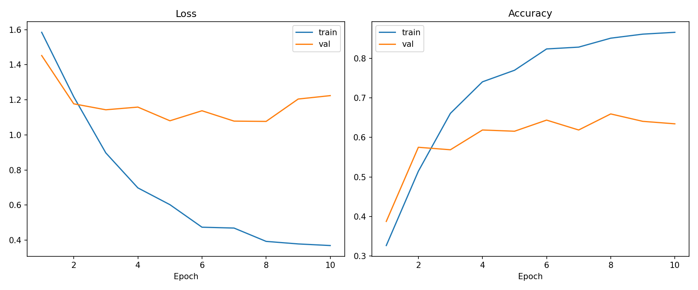
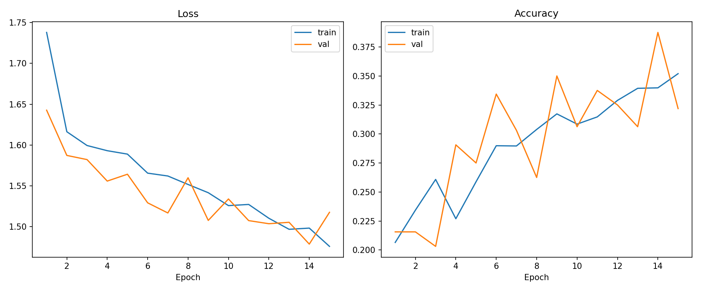
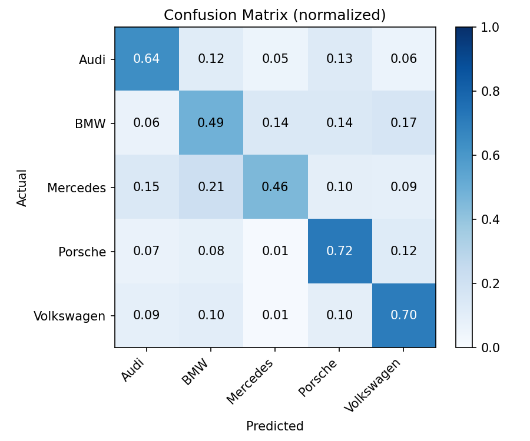
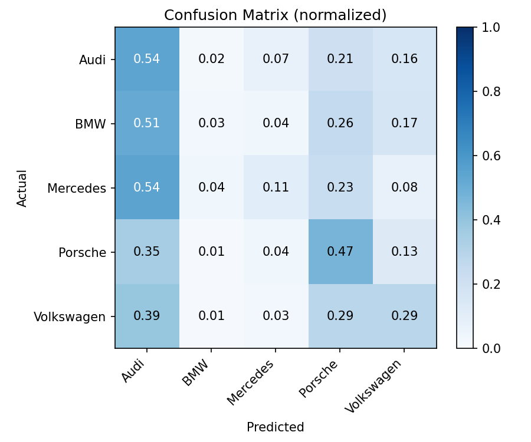
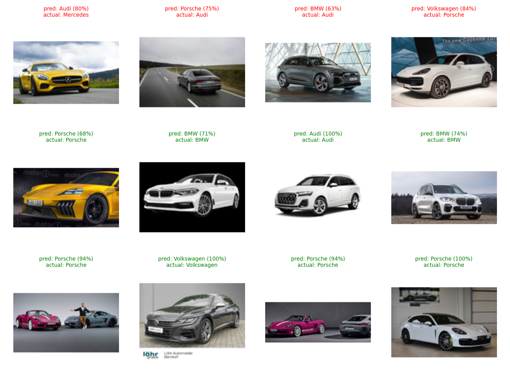

# Car Brand Classifier

A CNN that classifies photos of cars into 5 brands — Audi, BMW, Mercedes, Porsche, Volkswagen — trained on ~2,500 images scraped from Google Images. Includes a from-scratch CNN, a fine-tuned ResNet18 baseline, full evaluation (training curves, confusion matrix, per-class metrics, sample predictions), and a live demo.

**[Try the live demo on Hugging Face Spaces →](#)** *(link added after deployment, see [Deploying the demo](#deploying-the-demo))*

## Results

| Model | Params | Train acc | Val acc | Test acc | Train time (RTX/GTX GPU) |
|---|---|---|---|---|---|
| Custom CNN (`--model custom`, 15 epochs) | 8.7M | 34.0% | 38.8% | 30.5% | ~15 min |
| ResNet18, fine-tuned (`--model resnet18`, 10 epochs) | 11.2M | 85.1% | 65.9% | 61.0% | ~10 min |

*(Numbers are from each model's best-validation-loss checkpoint, evaluated once on the held-out test set. Full per-class breakdown in `outputs/*_classification_report.txt`.)*

The from-scratch CNN and the fine-tuned ResNet18 use identical data, transforms, and train/val/test splits — the only difference is the model. ResNet18 roughly doubles test accuracy in fewer epochs, which is exactly the expected result: 2,100 training images isn't enough to learn good visual features from scratch, but it's plenty to fine-tune features an ImageNet-pretrained network already has. (An earlier version of this comparison *froze* ResNet's backbone and only trained the final layer — that actually performed slightly *worse* than the custom CNN, since 10 epochs isn't enough to converge a linear probe. Fine-tuning the whole network is what makes transfer learning pay off here.)

The custom CNN's confusion matrix also shows a real failure mode worth being upfront about: it collapses toward predicting "Audi" for a lot of other brands (a capacity/data limitation), which the ResNet18 confusion matrix doesn't show nearly as much.

### Training curves

ResNet18 (fine-tuned) | Custom CNN
:---:|:---:
 | 

The ResNet18 curves show train accuracy climbing well past validation accuracy after epoch ~5 — some overfitting on a dataset this small, which is why the *val*-loss-best checkpoint (epoch 8, not epoch 10) is the one actually saved and evaluated.

### Confusion matrix

ResNet18 (fine-tuned) | Custom CNN
:---:|:---:
 | 

### Sample predictions

Green = correct, red = incorrect. The grid deliberately includes some of the model's mistakes, not just easy wins.



## Project structure

```
CarCrawler/
├── crawler.py    # scrapes Google Images to build Cars/train, then splits off Cars/test
├── src/
│   ├── data.py       # transforms, ImageFolder loading, train/val/test split
│   ├── model.py       # custom CNN + ResNet18 baseline
│   ├── engine.py       # train/eval step functions
│   └── evaluate.py      # curves, confusion matrix, classification report, sample grid
├── train.py       # CLI entrypoint: trains a model and writes everything to outputs/
├── app.py          # Gradio demo (local + Hugging Face Space)
├── outputs/         # checkpoints + generated plots (gitignored except this README's copies)
└── Cars/            # dataset (gitignored, see below)
```

## Setup

```bash
pip install -r requirements.txt
```

`pip install torch` from PyPI installs the **CPU-only** build by default, even on a machine with an NVIDIA GPU. If you have one, install a CUDA build first from the [PyTorch install selector](https://pytorch.org/get-started/locally/) (e.g. `pip install torch torchvision --index-url https://download.pytorch.org/whl/cu126`), then `pip install -r requirements.txt` for the rest. Training on CPU works but is noticeably slower.

## Getting the dataset

The `Cars/` folder (~1.5GB of scraped images) is not committed to this repo — the images come from Google Image Search and their licensing/copyright status is unclear, so they shouldn't be redistributed. Regenerate it locally instead:

```bash
python crawler.py
```

This downloads ~100 images per brand/model into `Cars/train/<brand>/<model>/`, then splits 20% off into `Cars/test/<brand>/<model>/`. Expect it to take a while and to need some manual cleanup (image search results are noisy). `ImageFolder` classifies by brand — it recursively picks up all images under each brand folder regardless of the model subfolder, so the class labels are the 5 brand names, not individual models.

## Training

```bash
# From-scratch CNN
python train.py --model custom --epochs 15

# ResNet18 fine-tune baseline
python train.py --model resnet18 --epochs 10
```

Useful flags: `--batch-size`, `--lr`, `--image-size`, `--val-split`, `--data-dir`. Each run:
1. Splits `Cars/train` into train/val (val is never used for gradient updates, only for the LR scheduler and checkpoint selection).
2. Trains, tracking the best-validation-loss checkpoint.
3. Evaluates that checkpoint on the untouched `Cars/test` set exactly once.
4. Writes `outputs/<model>_best.pth`, `outputs/<model>_curves.png`, `outputs/<model>_confusion_matrix.png`, `outputs/<model>_sample_predictions.png`, `outputs/<model>_classification_report.txt`.

### Design notes

- **Train/val/test split**: the original version of this project used the test set to drive the LR scheduler, which leaks test information into training decisions. Now validation and test are fully separate.
- **Class imbalance**: brand counts range from ~285–440 images in training, so the loss is class-weighted (inverse frequency) rather than left unweighted.
- **Aspect-ratio-preserving resize**: images are letterboxed to a square instead of squashed, so cars don't get visually distorted before the model sees them.
- **ResNet18 is fully fine-tuned, not frozen**: pass `--freeze-backbone` to only train the final layer instead (faster per-epoch, but converges far slower — see [Results](#results)).
- **Known limitation**: ResNet18's val accuracy plateaus/dips after ~epoch 8 while train accuracy keeps climbing — mild overfitting given ~2,100 training images. More data, stronger augmentation, or early stopping would likely close that gap further.

## Running the demo locally

```bash
python app.py
```

Opens a Gradio UI at `http://localhost:7860` — upload a car photo, get the top-5 predicted brand + confidence. Requires a checkpoint in `outputs/` (set which one via the `CAR_MODEL` env var, defaults to `resnet18`).

## Deploying the demo

1. Train a model and confirm `outputs/resnet18_best.pth` exists.
2. Create a new [Hugging Face Space](https://huggingface.co/new-space) (SDK: Gradio).
3. Push `app.py`, `src/`, `requirements.txt`, and the checkpoint to the Space repo (via `git` or `huggingface_hub.upload_file`).
4. Update the demo link at the top of this README.

## Requirements

- Python 3.9+
- PyTorch 1.10+ (CPU works fine; CUDA speeds up training)
